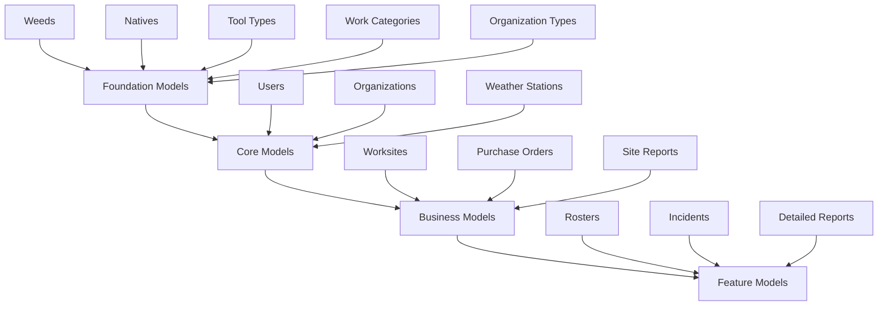

# Django Model Creation Guide

Welcome to the comprehensive guide for creating model instances in your Django application. This documentation is organized by model dependencies to ensure you create models in the correct order.

## Quick Start

1. **[Understanding Dependencies](getting-started/understanding-dependencies)** - Learn about model relationships
2. **[Navigation Overview](getting-started/navigation-overview)** - Familiarize yourself with the admin interface
3. **[Foundation Models](foundation-models/)** - Start with independent models
4. **[Core Models](core-models/)** - Build on foundation models
5. **[Business Models](business-models/)** - Implement main functionality
6. **[Feature Models](feature-models/)** - Add advanced features

## Model Creation Order

{: .label .label-green }
Recommended Order

Create models in this sequence to avoid dependency errors:

