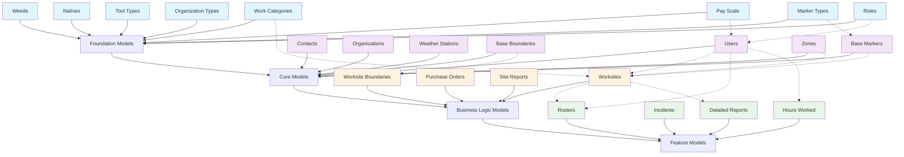

# Reporting System Model Creation Guide

Welcome to the comprehensive guide for creating model instances in your bush regeneration application. This documentation is organised by model dependencies to ensure you create models in the correct order.

## Quick Start

1. **[Understanding Dependencies](getting-started/understanding-dependencies)** - Learn about model relationships
2. **[Navigation Overview](getting-started/navigation-overview)** - Familiarize yourself with the admin interface
3. **[Foundation Models](foundation-models/)** - Start with independent models
4. **[Core Models](core-models/)** - Build on foundation models
5. **[Business Models](business-models/)** - Implement main functionality
6. **[Feature Models](feature-models/)** - Add advanced features

## Model Categories

### 🔵 Foundation Models
These models have no dependencies and should be created first:
- **Weeds & Natives**: Flora species definitions
- **Tool Types**: Equipment and tool categories  
- **Work Categories**: Types of work activities
- **Organization Types**: Client organization classifications
- **Pay Scale**: Hourly rates and compensation
- **Roles**: User permission groups
- **Marker Types**: Map marker classifications

### 🟣 Core Models  
These depend on Foundation models:
- **Users**: System users (staff) with roles and pay scales
- **Contacts**: People associated with organizations
- **Organizations**: Client companies and entities
- **Weather Stations**: Weather stations for spray reports
- **Base Boundaries**: Geographic area definitions
- **Base Markers**: Map location points
- **Zones**: Operational area divisions

### 🟠 Business Logic Models
These implement main business functionality:
- **Worksites**: Job locations (depend on boundaries, markers, zones)
- **Purchase Orders**: Equipment and supply requests
- **Site Reports**: Work completion documentation
- **Worksite Boundaries**: Specific work area definitions

### 🟢 Feature Models
Advanced features that depend on all previous layers:
- **Rosters**: Staff scheduling and assignments
- **Incidents**: Safety and issue reporting  
- **Detailed Reports**: Comprehensive work documentation
- **Hours Worked**: Time tracking and payroll

## Model Creation Order

{: .label .label-green }
Recommended Order

Create models in this sequence to avoid dependency errors:

---

## Getting Started

Begin with [Understanding Dependencies](getting-started/understanding-dependencies) to learn about model relationships, then proceed through the categories in order.